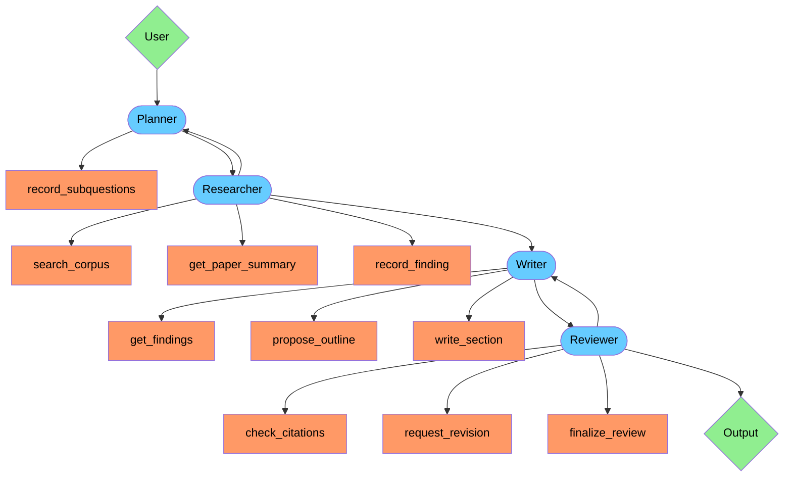

# agent workflow: agents, tools, handoffs

```mermaid
flowchart TD
    workflow_base_user{"User"}:::workflowBaseStyle
    workflow_base_output{"Output"}:::workflowBaseStyle
    workflow_agent_Planner(["Planner"]):::workflowAgentStyle
    workflow_tool_Planner_record_subquestions["record_subquestions"]:::workflowToolStyle
    workflow_agent_Researcher(["Researcher"]):::workflowAgentStyle
    workflow_tool_Researcher_search_corpus["search_corpus"]:::workflowToolStyle
    workflow_tool_Researcher_get_paper_summary["get_paper_summary"]:::workflowToolStyle
    workflow_tool_Researcher_record_finding["record_finding"]:::workflowToolStyle
    workflow_agent_Writer(["Writer"]):::workflowAgentStyle
    workflow_tool_Writer_get_findings["get_findings"]:::workflowToolStyle
    workflow_tool_Writer_propose_outline["propose_outline"]:::workflowToolStyle
    workflow_tool_Writer_write_section["write_section"]:::workflowToolStyle
    workflow_agent_Reviewer(["Reviewer"]):::workflowAgentStyle
    workflow_tool_Reviewer_check_citations["check_citations"]:::workflowToolStyle
    workflow_tool_Reviewer_request_revision["request_revision"]:::workflowToolStyle
    workflow_tool_Reviewer_finalize_review["finalize_review"]:::workflowToolStyle
    workflow_base_user --> workflow_agent_Planner
    workflow_agent_Planner --> workflow_tool_Planner_record_subquestions
    workflow_agent_Planner --> workflow_agent_Researcher
    workflow_agent_Researcher --> workflow_tool_Researcher_search_corpus
    workflow_agent_Researcher --> workflow_tool_Researcher_get_paper_summary
    workflow_agent_Researcher --> workflow_tool_Researcher_record_finding
    workflow_agent_Researcher --> workflow_agent_Planner
    workflow_agent_Researcher --> workflow_agent_Writer
    workflow_agent_Writer --> workflow_tool_Writer_get_findings
    workflow_agent_Writer --> workflow_tool_Writer_propose_outline
    workflow_agent_Writer --> workflow_tool_Writer_write_section
    workflow_agent_Writer --> workflow_agent_Reviewer
    workflow_agent_Reviewer --> workflow_tool_Reviewer_check_citations
    workflow_agent_Reviewer --> workflow_tool_Reviewer_request_revision
    workflow_agent_Reviewer --> workflow_tool_Reviewer_finalize_review
    workflow_agent_Reviewer --> workflow_agent_Writer
    workflow_agent_Reviewer --> workflow_base_output
    classDef stepStyle fill:#ADD8E6,color:#000000,line-height:1.2
    classDef externalStyle fill:#BEDAE4,color:#000000,line-height:1.2
    classDef resourceStyle fill:#DDA0DD,color:#000000,line-height:1.2
    classDef resourceConfigStyle fill:#B2DFDB,color:#000000,line-height:1.2
    classDef startEventStyle fill:#E27AFF,color:#000000
    classDef stopEventStyle fill:#FFA07A,color:#000000
    classDef defaultEventStyle fill:#90EE90,color:#000000
    classDef reactAgentStyle fill:#E27AFF,color:#000000
    classDef codeActAgentStyle fill:#66ccff,color:#000000
    classDef defaultAgentStyle fill:#90EE90,color:#000000
    classDef toolStyle fill:#ff9966,color:#000000
    classDef workflowBaseStyle fill:#90EE90,color:#000000
    classDef workflowAgentStyle fill:#66ccff,color:#000000
    classDef workflowToolStyle fill:#ff9966,color:#000000
    classDef workflowHandoffStyle fill:#E27AFF,color:#000000
    classDef childConnectorStyle fill:#E0E0E080,color:#555555,stroke-width:0px
```
