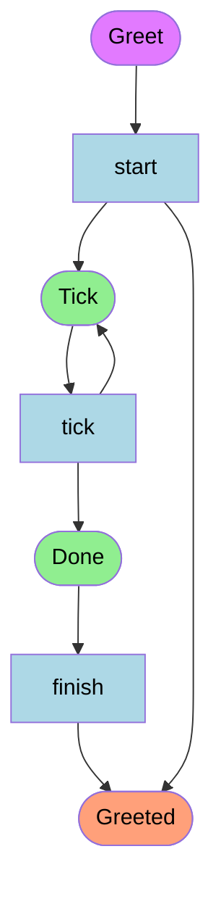

# hello workflow: all possible flows

```mermaid
flowchart TD
    step_finish["finish"]:::stepStyle
    event_Done(["Done"]):::defaultEventStyle
    event_Greeted(["Greeted"]):::stopEventStyle
    step_start["start"]:::stepStyle
    event_Greet(["Greet"]):::startEventStyle
    event_Tick(["Tick"]):::defaultEventStyle
    step_tick["tick"]:::stepStyle
    step_finish --> event_Greeted
    event_Done --> step_finish
    step_start --> event_Tick
    step_start --> event_Greeted
    event_Greet --> step_start
    step_tick --> event_Tick
    step_tick --> event_Done
    event_Tick --> step_tick
    classDef stepStyle fill:#ADD8E6,color:#000000,line-height:1.2
    classDef externalStyle fill:#BEDAE4,color:#000000,line-height:1.2
    classDef resourceStyle fill:#DDA0DD,color:#000000,line-height:1.2
    classDef resourceConfigStyle fill:#B2DFDB,color:#000000,line-height:1.2
    classDef startEventStyle fill:#E27AFF,color:#000000
    classDef stopEventStyle fill:#FFA07A,color:#000000
    classDef defaultEventStyle fill:#90EE90,color:#000000
    classDef reactAgentStyle fill:#E27AFF,color:#000000
    classDef codeActAgentStyle fill:#66ccff,color:#000000
    classDef defaultAgentStyle fill:#90EE90,color:#000000
    classDef toolStyle fill:#ff9966,color:#000000
    classDef workflowBaseStyle fill:#90EE90,color:#000000
    classDef workflowAgentStyle fill:#66ccff,color:#000000
    classDef workflowToolStyle fill:#ff9966,color:#000000
    classDef workflowHandoffStyle fill:#E27AFF,color:#000000
    classDef childConnectorStyle fill:#E0E0E080,color:#555555,stroke-width:0px
```
