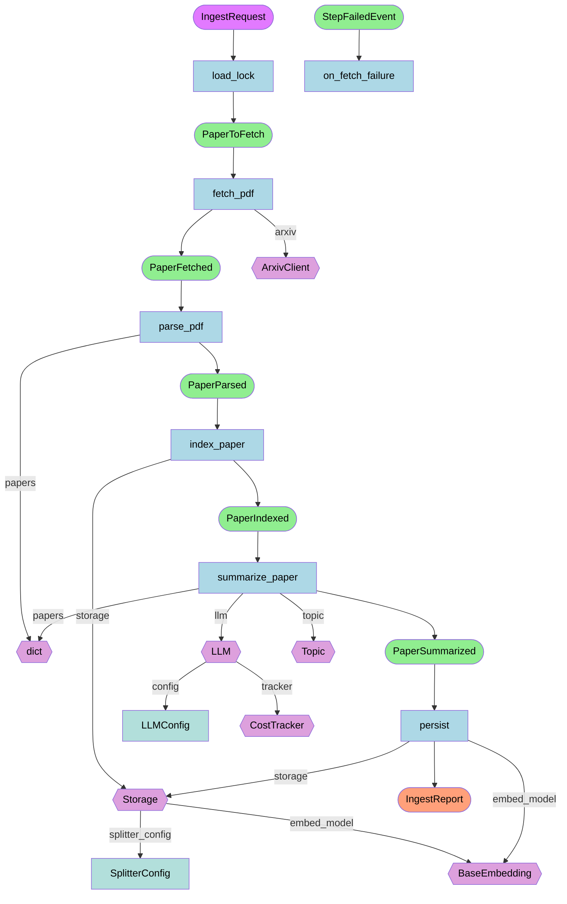

# ingest workflow: all possible flows

```mermaid
flowchart TD
    step_fetch_pdf["fetch_pdf"]:::stepStyle
    event_PaperToFetch(["PaperToFetch"]):::defaultEventStyle
    event_PaperFetched(["PaperFetched"]):::defaultEventStyle
    resource_resource_3449204d69cc{{"ArxivClient"}}:::resourceStyle
    step_index_paper["index_paper"]:::stepStyle
    event_PaperParsed(["PaperParsed"]):::defaultEventStyle
    event_PaperIndexed(["PaperIndexed"]):::defaultEventStyle
    resource_resource_290055995b5b{{"Storage"}}:::resourceStyle
    resource_config_resource_config_1157c4ad72c1["SplitterConfig"]:::resourceConfigStyle
    resource_resource_7786a419079b{{"BaseEmbedding"}}:::resourceStyle
    step_load_lock["load_lock"]:::stepStyle
    event_IngestRequest(["IngestRequest"]):::startEventStyle
    step_on_fetch_failure["on_fetch_failure"]:::stepStyle
    event_StepFailedEvent(["StepFailedEvent"]):::defaultEventStyle
    step_parse_pdf["parse_pdf"]:::stepStyle
    resource_resource_59578000a7cc{{"dict"}}:::resourceStyle
    step_persist["persist"]:::stepStyle
    event_PaperSummarized(["PaperSummarized"]):::defaultEventStyle
    event_IngestReport(["IngestReport"]):::stopEventStyle
    step_summarize_paper["summarize_paper"]:::stepStyle
    resource_resource_a0556b5da244{{"LLM"}}:::resourceStyle
    resource_config_resource_config_a4ea6a5fa368["LLMConfig"]:::resourceConfigStyle
    resource_resource_563010e4364d{{"CostTracker"}}:::resourceStyle
    resource_resource_3012ae4981ab{{"Topic"}}:::resourceStyle
    resource_resource_290055995b5b -->|"splitter_config"| resource_config_resource_config_1157c4ad72c1
    resource_resource_290055995b5b -->|"embed_model"| resource_resource_7786a419079b
    resource_resource_a0556b5da244 -->|"config"| resource_config_resource_config_a4ea6a5fa368
    resource_resource_a0556b5da244 -->|"tracker"| resource_resource_563010e4364d
    step_fetch_pdf --> event_PaperFetched
    event_PaperToFetch --> step_fetch_pdf
    step_fetch_pdf -->|"arxiv"| resource_resource_3449204d69cc
    step_index_paper --> event_PaperIndexed
    event_PaperParsed --> step_index_paper
    step_index_paper -->|"storage"| resource_resource_290055995b5b
    step_load_lock --> event_PaperToFetch
    event_IngestRequest --> step_load_lock
    event_StepFailedEvent --> step_on_fetch_failure
    step_parse_pdf --> event_PaperParsed
    event_PaperFetched --> step_parse_pdf
    step_parse_pdf -->|"papers"| resource_resource_59578000a7cc
    step_persist --> event_IngestReport
    event_PaperSummarized --> step_persist
    step_persist -->|"storage"| resource_resource_290055995b5b
    step_persist -->|"embed_model"| resource_resource_7786a419079b
    step_summarize_paper --> event_PaperSummarized
    event_PaperIndexed --> step_summarize_paper
    step_summarize_paper -->|"llm"| resource_resource_a0556b5da244
    step_summarize_paper -->|"papers"| resource_resource_59578000a7cc
    step_summarize_paper -->|"topic"| resource_resource_3012ae4981ab
    classDef stepStyle fill:#ADD8E6,color:#000000,line-height:1.2
    classDef externalStyle fill:#BEDAE4,color:#000000,line-height:1.2
    classDef resourceStyle fill:#DDA0DD,color:#000000,line-height:1.2
    classDef resourceConfigStyle fill:#B2DFDB,color:#000000,line-height:1.2
    classDef startEventStyle fill:#E27AFF,color:#000000
    classDef stopEventStyle fill:#FFA07A,color:#000000
    classDef defaultEventStyle fill:#90EE90,color:#000000
    classDef reactAgentStyle fill:#E27AFF,color:#000000
    classDef codeActAgentStyle fill:#66ccff,color:#000000
    classDef defaultAgentStyle fill:#90EE90,color:#000000
    classDef toolStyle fill:#ff9966,color:#000000
    classDef workflowBaseStyle fill:#90EE90,color:#000000
    classDef workflowAgentStyle fill:#66ccff,color:#000000
    classDef workflowToolStyle fill:#ff9966,color:#000000
    classDef workflowHandoffStyle fill:#E27AFF,color:#000000
    classDef childConnectorStyle fill:#E0E0E080,color:#555555,stroke-width:0px
```
