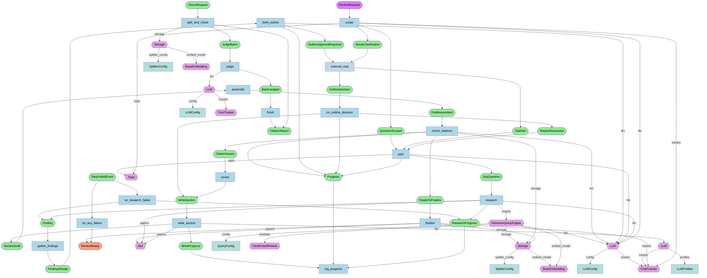

# review workflow: all possible flows

```mermaid
flowchart TD
    step_assemble["assemble"]:::stepStyle
    event_SectionDraft(["SectionDraft"]):::defaultEventStyle
    event_DraftAssembled(["DraftAssembled"]):::defaultEventStyle
    step_check_citations["check_citations"]:::stepStyle
    event_CitationIssues(["CitationIssues"]):::defaultEventStyle
    event_ReadyToFinalize(["ReadyToFinalize"]):::defaultEventStyle
    event_Progress(["Progress"]):::defaultEventStyle
    resource_resource_290055995b5b{{"Storage"}}:::resourceStyle
    resource_config_resource_config_1157c4ad72c1["SplitterConfig"]:::resourceConfigStyle
    resource_resource_7786a419079b{{"BaseEmbedding"}}:::resourceStyle
    resource_resource_a0556b5da244{{"LLM"}}:::resourceStyle
    resource_config_resource_config_a4ea6a5fa368["LLMConfig"]:::resourceConfigStyle
    resource_resource_563010e4364d{{"CostTracker"}}:::resourceStyle
    step_draft_outline["draft_outline"]:::stepStyle
    event_FindingsReady(["FindingsReady"]):::defaultEventStyle
    event_OutlineApprovalRequired(["OutlineApprovalRequired"]):::defaultEventStyle
    external_external_step["external_step"]:::externalStyle
    step_finalize["finalize"]:::stepStyle
    event_ReviewReady(["ReviewReady"]):::stopEventStyle
    resource_resource_59578000a7cc{{"dict"}}:::resourceStyle
    step_gather_findings["gather_findings"]:::stepStyle
    event_Finding(["Finding"]):::defaultEventStyle
    step_log_progress["log_progress"]:::stepStyle
    step_on_any_failure["on_any_failure"]:::stepStyle
    event_StepFailedEvent(["StepFailedEvent"]):::defaultEventStyle
    step_on_outline_decision["on_outline_decision"]:::stepStyle
    event_OutlineDecision(["OutlineDecision"]):::defaultEventStyle
    event_WriteSection(["WriteSection"]):::defaultEventStyle
    event_ReplanRequested(["ReplanRequested"]):::defaultEventStyle
    step_on_research_failed["on_research_failed"]:::stepStyle
    event_ResearchProgress(["ResearchProgress"]):::defaultEventStyle
    step_plan["plan"]:::stepStyle
    event_QuestionScoped(["QuestionScoped"]):::defaultEventStyle
    event_Clarified(["Clarified"]):::defaultEventStyle
    event_SubQuestion(["SubQuestion"]):::defaultEventStyle
    resource_resource_3012ae4981ab{{"Topic"}}:::resourceStyle
    step_research["research"]:::stepStyle
    resource_resource_fbbaac654c8d{{"RetrieverQueryEngine"}}:::resourceStyle
    resource_config_resource_config_f747bb284fb2["QueryConfig"]:::resourceConfigStyle
    resource_resource_b58f6508e641{{"FastEmbedRerank"}}:::resourceStyle
    step_revise["revise"]:::stepStyle
    step_scope["scope"]:::stepStyle
    event_ReviewRequest(["ReviewRequest"]):::startEventStyle
    event_NeedsClarification(["NeedsClarification"]):::defaultEventStyle
    step_write_section["write_section"]:::stepStyle
    event_WriteProgress(["WriteProgress"]):::defaultEventStyle
    resource_resource_85e6af5c9861{{"LLM"}}:::resourceStyle
    resource_config_resource_config_1e0e47d4b8cf["LLMProfiles"]:::resourceConfigStyle
    step_check_citations_CitationCheckWorkflow_finish["finish"]:::stepStyle
    event_check_citations_CitationCheckWorkflow_BatchJudged(["BatchJudged"]):::defaultEventStyle
    event_check_citations_CitationCheckWorkflow_CitationReport(["CitationReport"]):::defaultEventStyle
    step_check_citations_CitationCheckWorkflow_judge["judge"]:::stepStyle
    event_check_citations_CitationCheckWorkflow_JudgeBatch(["JudgeBatch"]):::defaultEventStyle
    resource_check_citations_CitationCheckWorkflow_resource_a0556b5da244{{"LLM"}}:::resourceStyle
    resource_config_check_citations_CitationCheckWorkflow_resource_config_a4ea6a5fa368["LLMConfig"]:::resourceConfigStyle
    resource_check_citations_CitationCheckWorkflow_resource_563010e4364d{{"CostTracker"}}:::resourceStyle
    step_check_citations_CitationCheckWorkflow_split_and_check["split_and_check"]:::stepStyle
    event_check_citations_CitationCheckWorkflow_CheckRequest(["CheckRequest"]):::defaultEventStyle
    resource_check_citations_CitationCheckWorkflow_resource_290055995b5b{{"Storage"}}:::resourceStyle
    resource_config_check_citations_CitationCheckWorkflow_resource_config_1157c4ad72c1["SplitterConfig"]:::resourceConfigStyle
    resource_check_citations_CitationCheckWorkflow_resource_7786a419079b{{"BaseEmbedding"}}:::resourceStyle
    resource_resource_290055995b5b -->|"splitter_config"| resource_config_resource_config_1157c4ad72c1
    resource_resource_290055995b5b -->|"embed_model"| resource_resource_7786a419079b
    resource_resource_a0556b5da244 -->|"config"| resource_config_resource_config_a4ea6a5fa368
    resource_resource_a0556b5da244 -->|"tracker"| resource_resource_563010e4364d
    resource_resource_fbbaac654c8d -->|"config"| resource_config_resource_config_f747bb284fb2
    resource_resource_fbbaac654c8d -->|"storage"| resource_resource_290055995b5b
    resource_resource_fbbaac654c8d -->|"embed_model"| resource_resource_7786a419079b
    resource_resource_fbbaac654c8d -->|"llm"| resource_resource_a0556b5da244
    resource_resource_fbbaac654c8d -->|"reranker"| resource_resource_b58f6508e641
    resource_resource_85e6af5c9861 -->|"profiles"| resource_config_resource_config_1e0e47d4b8cf
    resource_resource_85e6af5c9861 -->|"tracker"| resource_resource_563010e4364d
    step_assemble --> event_DraftAssembled
    event_SectionDraft --> step_assemble
    step_check_citations --> event_CitationIssues
    step_check_citations --> event_ReadyToFinalize
    step_check_citations --> event_Progress
    event_DraftAssembled --> step_check_citations
    step_check_citations -->|"storage"| resource_resource_290055995b5b
    step_check_citations -->|"llm"| resource_resource_a0556b5da244
    step_draft_outline --> event_OutlineApprovalRequired
    event_OutlineApprovalRequired --> external_external_step
    step_draft_outline --> event_Progress
    event_FindingsReady --> step_draft_outline
    step_draft_outline -->|"llm"| resource_resource_a0556b5da244
    step_finalize --> event_ReviewReady
    event_ReadyToFinalize --> step_finalize
    step_finalize -->|"papers"| resource_resource_59578000a7cc
    step_finalize -->|"storage"| resource_resource_290055995b5b
    step_finalize -->|"tracker"| resource_resource_563010e4364d
    step_gather_findings --> event_FindingsReady
    event_Finding --> step_gather_findings
    event_WriteProgress --> step_log_progress
    event_Progress --> step_log_progress
    event_ResearchProgress --> step_log_progress
    step_on_any_failure --> event_ReviewReady
    event_StepFailedEvent --> step_on_any_failure
    step_on_outline_decision --> event_WriteSection
    step_on_outline_decision --> event_ReplanRequested
    step_on_outline_decision --> event_Progress
    event_OutlineDecision --> step_on_outline_decision
    external_external_step --> event_OutlineDecision
    step_on_research_failed --> event_Finding
    step_on_research_failed --> event_ResearchProgress
    event_StepFailedEvent --> step_on_research_failed
    step_plan --> event_SubQuestion
    step_plan --> event_Progress
    event_QuestionScoped --> step_plan
    event_Clarified --> step_plan
    external_external_step --> event_Clarified
    event_ReplanRequested --> step_plan
    step_plan -->|"llm"| resource_resource_a0556b5da244
    step_plan -->|"topic"| resource_resource_3012ae4981ab
    step_research --> event_Finding
    step_research --> event_ResearchProgress
    event_SubQuestion --> step_research
    step_research -->|"engine"| resource_resource_fbbaac654c8d
    step_research -->|"llm"| resource_resource_a0556b5da244
    step_research -->|"papers"| resource_resource_59578000a7cc
    step_revise --> event_WriteSection
    event_CitationIssues --> step_revise
    step_scope --> event_QuestionScoped
    step_scope --> event_NeedsClarification
    event_NeedsClarification --> external_external_step
    event_ReviewRequest --> step_scope
    step_scope -->|"llm"| resource_resource_a0556b5da244
    step_scope -->|"topic"| resource_resource_3012ae4981ab
    step_scope -->|"tracker"| resource_resource_563010e4364d
    step_write_section --> event_SectionDraft
    step_write_section --> event_WriteProgress
    event_WriteSection --> step_write_section
    step_write_section -->|"llm"| resource_resource_85e6af5c9861
    step_write_section -->|"papers"| resource_resource_59578000a7cc
    resource_check_citations_CitationCheckWorkflow_resource_a0556b5da244 -->|"config"| resource_config_check_citations_CitationCheckWorkflow_resource_config_a4ea6a5fa368
    resource_check_citations_CitationCheckWorkflow_resource_a0556b5da244 -->|"tracker"| resource_check_citations_CitationCheckWorkflow_resource_563010e4364d
    resource_check_citations_CitationCheckWorkflow_resource_290055995b5b -->|"splitter_config"| resource_config_check_citations_CitationCheckWorkflow_resource_config_1157c4ad72c1
    resource_check_citations_CitationCheckWorkflow_resource_290055995b5b -->|"embed_model"| resource_check_citations_CitationCheckWorkflow_resource_7786a419079b
    step_check_citations_CitationCheckWorkflow_finish --> event_check_citations_CitationCheckWorkflow_CitationReport
    event_check_citations_CitationCheckWorkflow_BatchJudged --> step_check_citations_CitationCheckWorkflow_finish
    step_check_citations_CitationCheckWorkflow_judge --> event_check_citations_CitationCheckWorkflow_BatchJudged
    event_check_citations_CitationCheckWorkflow_JudgeBatch --> step_check_citations_CitationCheckWorkflow_judge
    step_check_citations_CitationCheckWorkflow_judge -->|"llm"| resource_check_citations_CitationCheckWorkflow_resource_a0556b5da244
    step_check_citations_CitationCheckWorkflow_split_and_check --> event_check_citations_CitationCheckWorkflow_JudgeBatch
    step_check_citations_CitationCheckWorkflow_split_and_check --> event_check_citations_CitationCheckWorkflow_CitationReport
    event_check_citations_CitationCheckWorkflow_CheckRequest --> step_check_citations_CitationCheckWorkflow_split_and_check
    step_check_citations_CitationCheckWorkflow_split_and_check -->|"storage"| resource_check_citations_CitationCheckWorkflow_resource_290055995b5b
    classDef stepStyle fill:#ADD8E6,color:#000000,line-height:1.2
    classDef externalStyle fill:#BEDAE4,color:#000000,line-height:1.2
    classDef resourceStyle fill:#DDA0DD,color:#000000,line-height:1.2
    classDef resourceConfigStyle fill:#B2DFDB,color:#000000,line-height:1.2
    classDef startEventStyle fill:#E27AFF,color:#000000
    classDef stopEventStyle fill:#FFA07A,color:#000000
    classDef defaultEventStyle fill:#90EE90,color:#000000
    classDef reactAgentStyle fill:#E27AFF,color:#000000
    classDef codeActAgentStyle fill:#66ccff,color:#000000
    classDef defaultAgentStyle fill:#90EE90,color:#000000
    classDef toolStyle fill:#ff9966,color:#000000
    classDef workflowBaseStyle fill:#90EE90,color:#000000
    classDef workflowAgentStyle fill:#66ccff,color:#000000
    classDef workflowToolStyle fill:#ff9966,color:#000000
    classDef workflowHandoffStyle fill:#E27AFF,color:#000000
    classDef childConnectorStyle fill:#E0E0E080,color:#555555,stroke-width:0px
```
