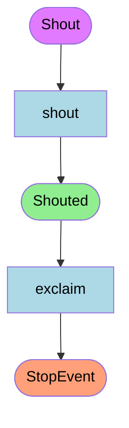

# tiny workflow: all possible flows

```mermaid
flowchart TD
    step_shout["shout"]:::stepStyle
    event_Shout(["Shout"]):::startEventStyle
    event_Shouted(["Shouted"]):::defaultEventStyle
    step_exclaim["exclaim"]:::stepStyle
    event_StopEvent(["StopEvent"]):::stopEventStyle
    step_shout --> event_Shouted
    event_Shout --> step_shout
    step_exclaim --> event_StopEvent
    event_Shouted --> step_exclaim
    classDef stepStyle fill:#ADD8E6,color:#000000,line-height:1.2
    classDef externalStyle fill:#BEDAE4,color:#000000,line-height:1.2
    classDef resourceStyle fill:#DDA0DD,color:#000000,line-height:1.2
    classDef resourceConfigStyle fill:#B2DFDB,color:#000000,line-height:1.2
    classDef startEventStyle fill:#E27AFF,color:#000000
    classDef stopEventStyle fill:#FFA07A,color:#000000
    classDef defaultEventStyle fill:#90EE90,color:#000000
    classDef reactAgentStyle fill:#E27AFF,color:#000000
    classDef codeActAgentStyle fill:#66ccff,color:#000000
    classDef defaultAgentStyle fill:#90EE90,color:#000000
    classDef toolStyle fill:#ff9966,color:#000000
    classDef workflowBaseStyle fill:#90EE90,color:#000000
    classDef workflowAgentStyle fill:#66ccff,color:#000000
    classDef workflowToolStyle fill:#ff9966,color:#000000
    classDef workflowHandoffStyle fill:#E27AFF,color:#000000
    classDef childConnectorStyle fill:#E0E0E080,color:#555555,stroke-width:0px
```
