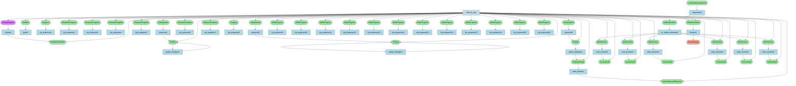

# Execution of this run

```mermaid
flowchart TD
    external_step["external_step"]:::externalStyle
    event_ReviewRequest_0(["ReviewRequest"]):::startEventStyle
    step_scope_1["scope#1"]:::stepStyle
    event_NeedsClarification_1(["NeedsClarification"]):::defaultEventStyle
    event_Clarified_2(["Clarified"]):::defaultEventStyle
    step_plan_1["plan#1"]:::stepStyle
    event_Progress_3(["Progress"]):::defaultEventStyle
    event_SubQuestion_4(["SubQuestion"]):::defaultEventStyle
    step_log_progress_1["log_progress#1"]:::stepStyle
    event_SubQuestion_5(["SubQuestion"]):::defaultEventStyle
    event_SubQuestion_6(["SubQuestion"]):::defaultEventStyle
    event_ResearchProgress_7(["ResearchProgress"]):::defaultEventStyle
    event_ResearchProgress_8(["ResearchProgress"]):::defaultEventStyle
    step_log_progress_2["log_progress#2"]:::stepStyle
    event_ResearchProgress_9(["ResearchProgress"]):::defaultEventStyle
    step_log_progress_3["log_progress#3"]:::stepStyle
    step_log_progress_4["log_progress#4"]:::stepStyle
    step_research_1["research#1"]:::stepStyle
    event_Finding_10(["Finding"]):::defaultEventStyle
    event_ResearchProgress_11(["ResearchProgress"]):::defaultEventStyle
    step_gather_findings_1["gather_findings#1"]:::stepStyle
    step_log_progress_5["log_progress#5"]:::stepStyle
    step_research_2["research#2"]:::stepStyle
    event_Finding_12(["Finding"]):::defaultEventStyle
    event_ResearchProgress_13(["ResearchProgress"]):::defaultEventStyle
    step_gather_findings_2["gather_findings#2"]:::stepStyle
    step_log_progress_6["log_progress#6"]:::stepStyle
    step_research_3["research#3"]:::stepStyle
    event_Finding_14(["Finding"]):::defaultEventStyle
    event_ResearchProgress_15(["ResearchProgress"]):::defaultEventStyle
    step_gather_findings_3["gather_findings#3"]:::stepStyle
    event_FindingsReady_16(["FindingsReady"]):::defaultEventStyle
    step_log_progress_7["log_progress#7"]:::stepStyle
    step_draft_outline_1["draft_outline#1"]:::stepStyle
    event_OutlineApprovalRequired_17(["OutlineApprovalRequired"]):::defaultEventStyle
    event_Progress_18(["Progress"]):::defaultEventStyle
    event_OutlineDecision_19(["OutlineDecision"]):::defaultEventStyle
    step_log_progress_8["log_progress#8"]:::stepStyle
    step_on_outline_decision_1["on_outline_decision#1"]:::stepStyle
    event_WriteSection_20(["WriteSection"]):::defaultEventStyle
    event_WriteSection_21(["WriteSection"]):::defaultEventStyle
    event_WriteSection_22(["WriteSection"]):::defaultEventStyle
    event_WriteSection_23(["WriteSection"]):::defaultEventStyle
    event_WriteSection_24(["WriteSection"]):::defaultEventStyle
    event_WriteSection_25(["WriteSection"]):::defaultEventStyle
    event_WriteProgress_26(["WriteProgress"]):::defaultEventStyle
    event_WriteProgress_27(["WriteProgress"]):::defaultEventStyle
    step_log_progress_9["log_progress#9"]:::stepStyle
    event_WriteProgress_28(["WriteProgress"]):::defaultEventStyle
    step_log_progress_10["log_progress#10"]:::stepStyle
    step_log_progress_11["log_progress#11"]:::stepStyle
    step_write_section_1["write_section#1"]:::stepStyle
    event_SectionDraft_29(["SectionDraft"]):::defaultEventStyle
    event_WriteProgress_30(["WriteProgress"]):::defaultEventStyle
    event_WriteProgress_31(["WriteProgress"]):::defaultEventStyle
    step_log_progress_12["log_progress#12"]:::stepStyle
    step_log_progress_13["log_progress#13"]:::stepStyle
    step_write_section_2["write_section#2"]:::stepStyle
    event_SectionDraft_32(["SectionDraft"]):::defaultEventStyle
    event_WriteProgress_33(["WriteProgress"]):::defaultEventStyle
    event_WriteProgress_34(["WriteProgress"]):::defaultEventStyle
    step_log_progress_14["log_progress#14"]:::stepStyle
    step_log_progress_15["log_progress#15"]:::stepStyle
    step_write_section_3["write_section#3"]:::stepStyle
    event_SectionDraft_35(["SectionDraft"]):::defaultEventStyle
    event_WriteProgress_36(["WriteProgress"]):::defaultEventStyle
    event_WriteProgress_37(["WriteProgress"]):::defaultEventStyle
    step_log_progress_16["log_progress#16"]:::stepStyle
    step_log_progress_17["log_progress#17"]:::stepStyle
    step_write_section_4["write_section#4"]:::stepStyle
    event_SectionDraft_38(["SectionDraft"]):::defaultEventStyle
    event_WriteProgress_39(["WriteProgress"]):::defaultEventStyle
    step_log_progress_18["log_progress#18"]:::stepStyle
    step_write_section_5["write_section#5"]:::stepStyle
    event_SectionDraft_40(["SectionDraft"]):::defaultEventStyle
    event_WriteProgress_41(["WriteProgress"]):::defaultEventStyle
    step_log_progress_19["log_progress#19"]:::stepStyle
    step_write_section_6["write_section#6"]:::stepStyle
    event_SectionDraft_42(["SectionDraft"]):::defaultEventStyle
    event_WriteProgress_43(["WriteProgress"]):::defaultEventStyle
    step_assemble_1["assemble#1"]:::stepStyle
    event_CollectionReleaseEvent_44(["CollectionReleaseEvent"]):::defaultEventStyle
    event_DraftAssembled_45(["DraftAssembled"]):::defaultEventStyle
    step_log_progress_20["log_progress#20"]:::stepStyle
    step_finalize_1["finalize#1"]:::stepStyle
    event_ReviewReady_46(["ReviewReady"]):::stopEventStyle
    external_step --> event_ReviewRequest_0
    event_ReviewRequest_0 --> step_scope_1
    step_scope_1 --> event_NeedsClarification_1
    external_step --> event_NeedsClarification_1
    external_step --> event_Clarified_2
    event_Clarified_2 --> step_plan_1
    external_step --> event_Progress_3
    external_step --> event_SubQuestion_4
    event_Progress_3 --> step_log_progress_1
    external_step --> event_SubQuestion_5
    external_step --> event_SubQuestion_6
    external_step --> event_ResearchProgress_7
    external_step --> event_ResearchProgress_8
    event_ResearchProgress_7 --> step_log_progress_2
    external_step --> event_ResearchProgress_9
    event_ResearchProgress_8 --> step_log_progress_3
    event_ResearchProgress_9 --> step_log_progress_4
    event_SubQuestion_6 --> step_research_1
    step_research_1 --> event_Finding_10
    external_step --> event_Finding_10
    external_step --> event_ResearchProgress_11
    event_Finding_10 --> step_gather_findings_1
    step_gather_findings_1 --> event_Finding_10
    event_ResearchProgress_11 --> step_log_progress_5
    event_SubQuestion_4 --> step_research_2
    step_research_2 --> event_Finding_12
    external_step --> event_Finding_12
    external_step --> event_ResearchProgress_13
    event_Finding_12 --> step_gather_findings_2
    step_gather_findings_2 --> event_Finding_12
    event_ResearchProgress_13 --> step_log_progress_6
    event_SubQuestion_5 --> step_research_3
    step_research_3 --> event_Finding_14
    external_step --> event_Finding_14
    external_step --> event_ResearchProgress_15
    event_Finding_14 --> step_gather_findings_3
    step_gather_findings_3 --> event_FindingsReady_16
    external_step --> event_FindingsReady_16
    event_ResearchProgress_15 --> step_log_progress_7
    event_FindingsReady_16 --> step_draft_outline_1
    step_draft_outline_1 --> event_OutlineApprovalRequired_17
    external_step --> event_OutlineApprovalRequired_17
    external_step --> event_Progress_18
    external_step --> event_OutlineDecision_19
    event_Progress_18 --> step_log_progress_8
    event_OutlineDecision_19 --> step_on_outline_decision_1
    step_on_outline_decision_1 --> event_WriteSection_20
    step_on_outline_decision_1 --> event_WriteSection_21
    step_on_outline_decision_1 --> event_WriteSection_22
    step_on_outline_decision_1 --> event_WriteSection_23
    step_on_outline_decision_1 --> event_WriteSection_24
    step_on_outline_decision_1 --> event_WriteSection_25
    external_step --> event_WriteSection_20
    external_step --> event_WriteSection_21
    external_step --> event_WriteSection_22
    external_step --> event_WriteSection_23
    external_step --> event_WriteSection_24
    external_step --> event_WriteSection_25
    external_step --> event_WriteProgress_26
    external_step --> event_WriteProgress_27
    event_WriteProgress_26 --> step_log_progress_9
    external_step --> event_WriteProgress_28
    event_WriteProgress_27 --> step_log_progress_10
    event_WriteProgress_28 --> step_log_progress_11
    event_WriteSection_21 --> step_write_section_1
    step_write_section_1 --> event_SectionDraft_29
    external_step --> event_SectionDraft_29
    external_step --> event_WriteProgress_30
    external_step --> event_WriteProgress_31
    event_WriteProgress_30 --> step_log_progress_12
    event_WriteProgress_31 --> step_log_progress_13
    event_WriteSection_20 --> step_write_section_2
    step_write_section_2 --> event_SectionDraft_32
    external_step --> event_SectionDraft_32
    external_step --> event_WriteProgress_33
    external_step --> event_WriteProgress_34
    event_WriteProgress_33 --> step_log_progress_14
    event_WriteProgress_34 --> step_log_progress_15
    event_WriteSection_22 --> step_write_section_3
    step_write_section_3 --> event_SectionDraft_35
    external_step --> event_SectionDraft_35
    external_step --> event_WriteProgress_36
    external_step --> event_WriteProgress_37
    event_WriteProgress_36 --> step_log_progress_16
    event_WriteProgress_37 --> step_log_progress_17
    event_WriteSection_23 --> step_write_section_4
    step_write_section_4 --> event_SectionDraft_38
    external_step --> event_SectionDraft_38
    external_step --> event_WriteProgress_39
    event_WriteProgress_39 --> step_log_progress_18
    event_WriteSection_25 --> step_write_section_5
    step_write_section_5 --> event_SectionDraft_40
    external_step --> event_SectionDraft_40
    external_step --> event_WriteProgress_41
    event_WriteProgress_41 --> step_log_progress_19
    event_WriteSection_24 --> step_write_section_6
    step_write_section_6 --> event_SectionDraft_42
    external_step --> event_SectionDraft_42
    external_step --> event_WriteProgress_43
    event_CollectionReleaseEvent_44 --> step_assemble_1
    step_assemble_1 --> event_DraftAssembled_45
    external_step --> event_DraftAssembled_45
    event_WriteProgress_43 --> step_log_progress_20
    event_DraftAssembled_45 --> step_finalize_1
    step_finalize_1 --> event_ReviewReady_46
    classDef stepStyle fill:#ADD8E6,color:#000000,line-height:1.2
    classDef externalStyle fill:#BEDAE4,color:#000000,line-height:1.2
    classDef resourceStyle fill:#DDA0DD,color:#000000,line-height:1.2
    classDef resourceConfigStyle fill:#B2DFDB,color:#000000,line-height:1.2
    classDef startEventStyle fill:#E27AFF,color:#000000
    classDef stopEventStyle fill:#FFA07A,color:#000000
    classDef defaultEventStyle fill:#90EE90,color:#000000
    classDef reactAgentStyle fill:#E27AFF,color:#000000
    classDef codeActAgentStyle fill:#66ccff,color:#000000
    classDef defaultAgentStyle fill:#90EE90,color:#000000
    classDef toolStyle fill:#ff9966,color:#000000
    classDef workflowBaseStyle fill:#90EE90,color:#000000
    classDef workflowAgentStyle fill:#66ccff,color:#000000
    classDef workflowToolStyle fill:#ff9966,color:#000000
    classDef workflowHandoffStyle fill:#E27AFF,color:#000000
```
